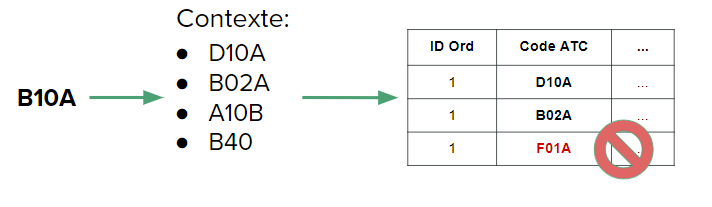
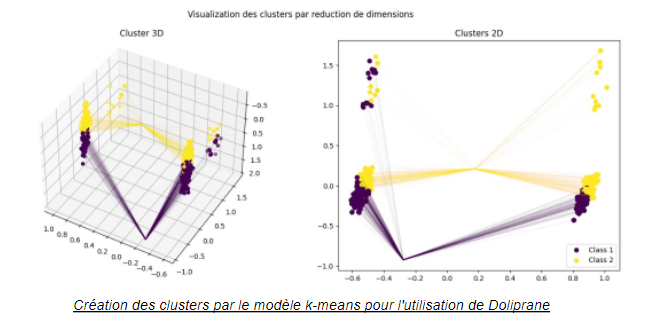
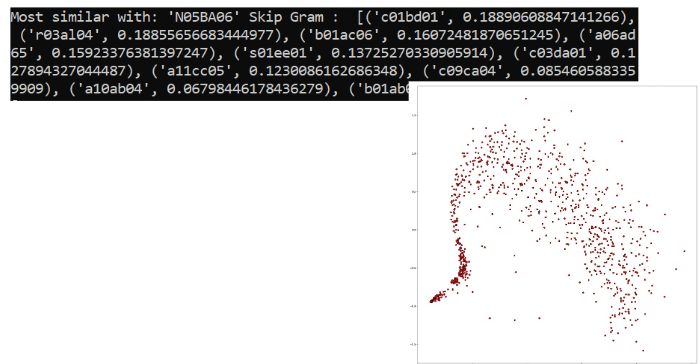

# Drug Iatrogeny Detector 💊
##### Machine Learning Detector for Drug Iatrogeny for the CHU Lille

Created by: [**Nicolas Acevedo**](https://github.com/nicoacevedor), [**Pablo Aldana**](https://github.com/Paldana99), [**Marie Lenglet**](https://github.com/mlenglet), [**Andreis Purim**](https://github.com/AndreisPurim) and [**Pablo Skewes**](https://github.com/pabloskewes)

This is an older project for the M1 Elective "Inteligence Artificel et Santé" at the École Centrale de Lille. The objective was to implement something inovative at the Centre Hospitalier Universitaire de Lille (CHU Lille) combining health and IA. We decided to create a program that every time a doctor added a new prescription, it would check and detect if it is correct and/or can cause further problems for the patient.

Since the data (which can't be released publicly, sorry) we had access to were prescriptions of past patients which were CORRECT, we had to work with unsupervised learning, especially clustering. The report is in the repository. A few explicative images can also help:

_Image explaining the basic idea: the doctor adds the drug prescription and the program detects incorrect ones_

_Some clustering with Doliprame. Since this was done with a PCA, it makes senses the clusters look slightly weird._

_Word2Vec made with the Code ATC from the prescription texts_

Since it is not maintained anymore (and it depends on other resources exclusive to the CHU), I'm leaving this as a legacy project. 

  
